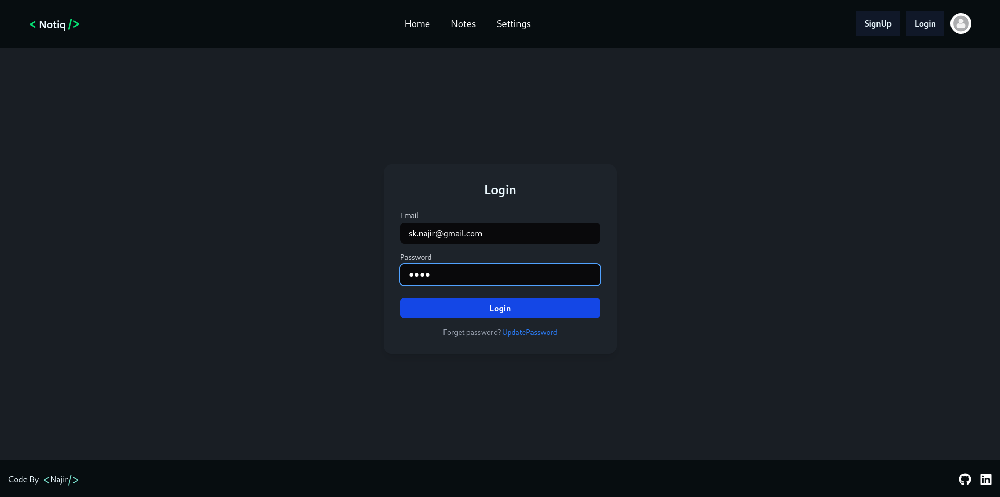
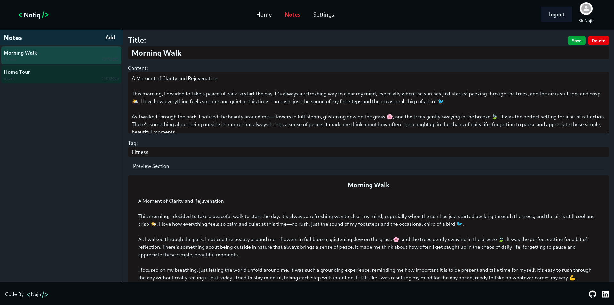

# 📝 NoteApp

A full-stack, modern note-taking web app built with **React (Vite)** on the frontend and **Express + MongoDB** on the backend. Create, edit, delete, and manage notes with a clean UI and persistent authentication — ideal for students, developers, and productivity lovers.

🔗 **Live Demo:** [https://note-app-pi-two-97.vercel.app/]

---

## 📁 Project Structure

<pre>
 <b>NoteApp/</b>  
        <pre>├── client/ ← React + Vite frontend (TailwindCSS, Zustand, React Router) </pre><pre>├── server/ ← Node.js + Express backend (JWT Auth, MongoDB via Mongoose)</pre>
 </pre>

---

## 📸 Screenshot

- Login Page
 
- Home Page
 
                                                                                                                                                                                                                                                                                                                                                                                                                                                                                                                                                                                                              

## ✨ Features

### ✅ Frontend (`client/`)
- **React 19 + Vite** for blazing-fast UI
- **Zustand** for minimal global state management
- **React Router v7** for route-based navigation
- **TailwindCSS + DaisyUI** for modern styling
- **React Toastify** for smooth notifications
- **Responsive design** optimized for both mobile and desktop
- **Dark mode support** using Tailwind classes (e.g., `.samplebg`, `.text-bg`, etc.)

### 🛠 Backend (`server/`)
- **Express 5** REST API
- **MongoDB + Mongoose** for scalable data storage
- **JWT authentication** with secure cookies
- **dotenv**, **CORS**, and modular route handling
- **Nodemon** for hot-reloading during dev

---
